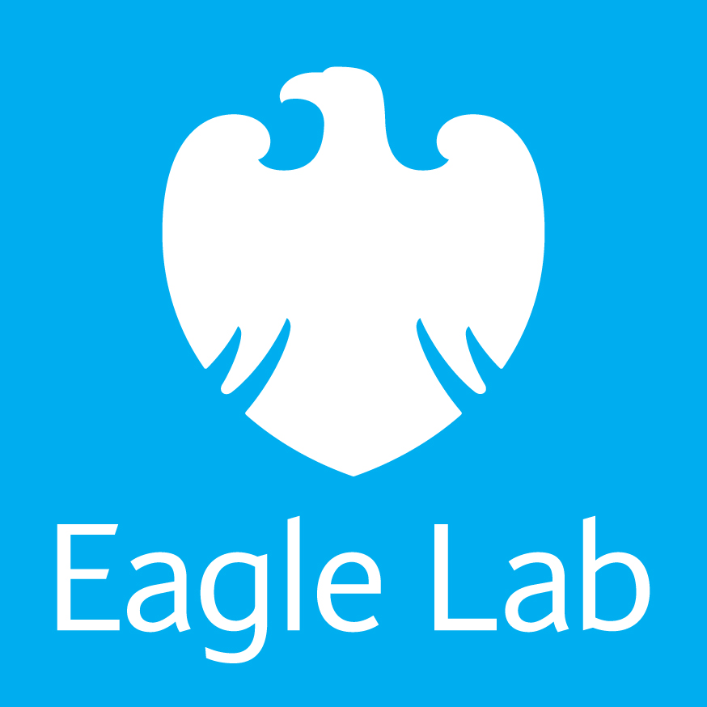

---

layout: col-sidebar
title: OWASP Dorset
tags: dorset chapter meetup ctf
level: 4

region: Europe

---

## Participation
OWASP Foundation (Overview Slides) is a professional association of global members and is open to anyone interested in learning more about software security. Local chapters are run independently and guided by the Chapter Leader Handbook. As a 501(c)(3) non-profit professional association your support and sponsorship of any meeting venue and/or refreshments is tax-deductible. Financial contributions should only be made online using the authorized online chapter donation button. To be a SPEAKER at ANY OWASP Chapter in the world simply review the speaker agreement and then contact the local chapter leader with details of what OWASP PROJECT, independent research or related software security topic you would like to present on.

## Chapter Sponsors
We welcome OWASP Corporate Members who would like to align themselves with the Dorset chapter, therefore contributing funds to our chapter and allowing us to host more events. Sponsor OWASP Dorset Chapter.

## Event Sponsors
We also welcome donations from organisations for individual OWASP events, donations can be from providing event space to hosting a meetup or financial donation which is put towards providing refreshments at the event and providing a buffer fund to help the chapter support the community and allow us to bring in speakers from further afield.

<table cellpadding="15" cellspacing="0">
<tr>
<td>

</td>
<td>

</td>
<td>

</td>
</tr>
<tr>
<td>

</td>
<td>

</td>
</tr>
</table>

## Speaking at OWASP Dorset Chapter Events
Call For Speakers is always open - if you would like to present a talk on any aspect of cyber security at a future OWASP Dorset Chapter event - please review and ensure you agree with the OWASP Speaker Agreement and send the proposed talk title, abstract and speaker bio to any of our Chapter Leaders.
We also welcome people new to public speaking and can offer advice and coaching. We are a friendly and supportive community, come give your first talk with us!

## Code of Conduct
We hope you enjoy our events, we care deeply about inclusivity and diversity so that OWASP is a comfortable and welcoming community for everyone. Please reach out to one of our chapter leader if you have any feedback or would like to speak to us, we take these matters very seriously. You can find out more about our policies [here](https://www.owasp.org/index.php/Governance/Conference_Policies).

## Next Event
January 2020

Location: JPMC, 1 Chaseside, Bournemouth BH7 7DA

Time: 18:00 

Talks:
* OWASP lead Daniel Warden will walk us through OWASP Zed Attack Proxy (ZAP)
* JPMC Security Engineer Mike Warner - Wireless De-auth attacks and handshake captures
* JPMC Security Engineer Anthony Grimes - WebAuthn: A new standard in securing ourselves online
* Sophia McCall - Hunted? Hunter! (An insight into my time on Hunted (Channel 4) as a cyber hunter, detailing the techniques we used to find the fugitives on the show)

